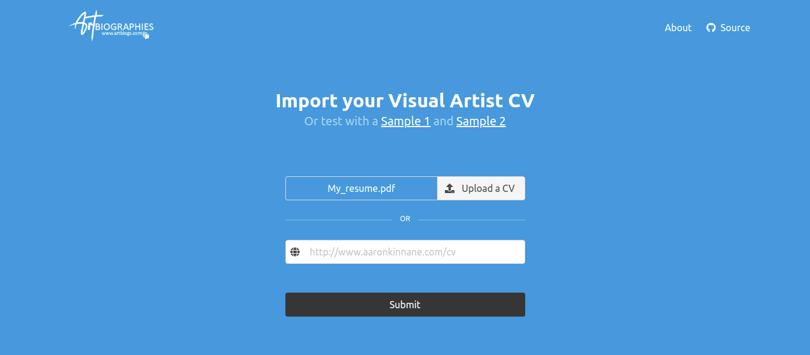

# Artbiogs - Artist CV Parser

> A web application that uses AI/ML to detect Artist's Exhibition details from a CV.




# Deploy

[](https://heroku.com/deploy)

# Development

You require Python 3.6 or greater. First clone the repository and change directory to the project folder. Then create a virtual environment:

```bash
python3 -m virtualenv .venv
source .venv/bin/activate
```

Now, run the following:

```bash
python3 setup.py develop
```

This installs all the necessary dependencies to run the python project. Now, lets launch the web application by running:

```bash
python3 web/app.py
```

You can now view the application at [http://localhost:5000](localhost:5000)

# Features

# Todo

0. Logo - Art Biogs
1. Check if part of the ending string is a location
2. Ranged dates are no handled. 2012-13, picks out -13
3. The page header date watermarks by chrome print pdf is stopping from proceeding further.
4. Add check if date is in between.
5. Create a bucket if does not exist.
6. IAM provide access only to one bucket. IAM limit expenditure.
7. Change wbwebkit to chrome headless with header and footers disabled.
8. Stop script/job if user closes window
9. Make it mobile responsive.
10. Review file permissions.
11. Change region

# CV Exception cases

1. "Solo Exhibitions" make not be the right marker. In this [example](https://annaglynn.com/cv.html), it is named as "Major Exhibitions" instead. Here is [another example](http://pennymason.com.au/cv) where its named "One Person Exhibitions"
2. The year and the corresponding text may be detected together [as one string](https://annaglynn.com/cv.html), rather than separate chunks.
3. Remove titles with less than 5 characters - Martin.

# Web interface

- Handle bad file types.
- Remove file after it has been processed.
